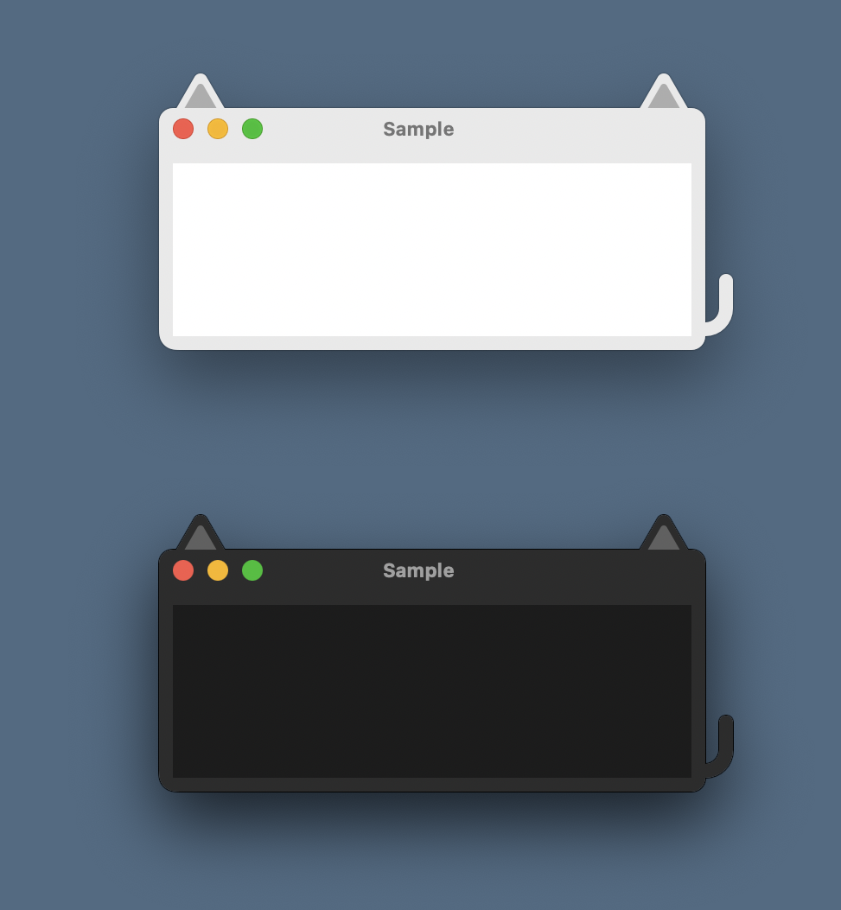

# NSCatWindow

<!-- # Short Description -->

Provides NSWindow with cat ears and tail

<!-- # Badges -->

[](https://github.com/Kyome22/NSCatWindow/issues)
[](https://github.com/Kyome22/NSCatWindow/network/members)
[](https://github.com/Kyome22/NSCatWindow/stargazers)
[](https://github.com/Kyome22/NSCatWindow/)
[](https://github.com/Kyome22/NSCatWindow/)

# Tags

`Swift` `AppKit`

# Demo



# Minimal Example

```swift
let hostingView = NSHostingView(rootView: SomeSwiftUIView())
hostingView.setFrameSize(hostingView.fittingSize)
let catWindow = NSCatWindow(childView: hostingView)
catWindow.makeKeyAndOrderFront(nil)
```

# Contributors

- [Kyome22](https://github.com/Kyome22)

<!-- CREATED_BY_LEADYOU_README_GENERATOR -->
